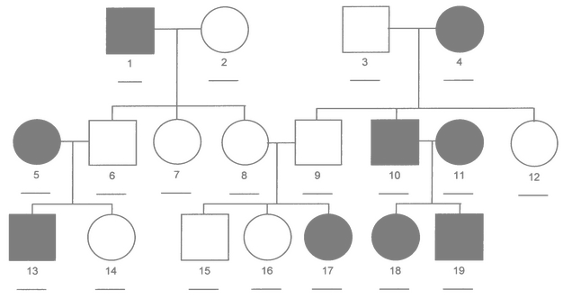

```{r setup-knitr, include=FALSE, purl=FALSE, eval = FALSE}
library(knitr)
opts_chunk$set(echo       = TRUE,
               message    = TRUE,
               warning    = TRUE,
               # comment    = NA,
               fig.width  = 4,
               fig.height = 3,
               cache      = TRUE,
               autodep    = TRUE,
               ## invalidate cache when either versions of R or breedR change
               ## http://yihui.name/knitr/demo/cache/
               cache.extra= list(R.version, packageVersion('breedR')))
```


```{r setup, include = FALSE}
library(breedR)
library(ggplot2)
```


# Intro

## What is **breedR**

- R-package implementing **statistical models** specifically suited for forest genetic resources analysts.
- Ultimately [Mixed Models](https://en.wikipedia.org/wiki/Mixed_model), but not necessarily easy to implement and use
- **breedR** acts as an **interface** which provides the means to:

    1. **Combine** any number of these models as **components** of a larger model
    2. Compute automatically **incidence** and **covariance matrices** from a few input parameters
    3. **Fit** the model
    4. Plot data and results, and perform **model diagnostics**


## Installation

- Project web page [http://famuvie.github.io/breedR/](http://famuvie.github.io/breedR/)
    - Set up this URL as a package repository in `.Rprofile` (detailed instructions on the web)
    - `install.packages('breedR')`
    - Not possible to use `CRAN` due to closed-source [`BLUPF90`](http://nce.ads.uga.edu/wiki/doku.php) programs

- GitHub dev-site [https://github.com/famuvie/breedR](https://github.com/famuvie/breedR)
    - `if( !require(devtools) ) install.packages('devtools')`
    - `devtools::install_github('famuvie/breedR')`


## Where to find help

- Package's help: `help(package = breedR)`
    - Help pages `?remlf90`
    - Code demos `demo(topic, package = 'breedR')` (omit `topic` for a list)
    - Vignettes `vignette(package = 'breedR')` (pkg and wiki)
  
- [Wiki pages](https://github.com/famuvie/breedR/wiki)
    - Guides, tutorials, FAQ

- Mailing list [http://groups.google.com/group/breedr](http://groups.google.com/group/breedr)
    - Questions and debates about usage and interface

- [Issues page](https://github.com/famuvie/breedR/issues)
    - Bug reports
    - Feature requests
    

## License


- **breedR** is FOSS. Licensed [GPL-3](http://www.gnu.org/licenses/gpl-3.0.html)
    - `RShowDoc('LICENSE', package = 'breedR')`
- You can **use** and **distribute** **breedR** for any purpose
- You can **modify** it to suit your needs
    - we encourage to!
    - please consider contributing your improvements
    - you can **distribute** your modified version under the GPL

- However, **breedR** makes (intensive) use of the [`BLUPF90`](http://nce.ads.uga.edu/wiki/doku.php) suite of Fortran programs, which are for *free* but not **free** (remember CRAN?)


## Roadmap | Future developments

- Bayesian inference

- Multi-trait support

- Genotype$\times$Environment interaction

- Support for longitudinal data


# Functionality 

[](https://raw.githubusercontent.com/wiki/famuvie/breedR/img/breedR_functionality.png "Functionality")


# Inference

## Frequentist

- Currently, only **frequentist inference** is supported via REML estimation of variance components.

- The function `remlf90()`, provides an interface to both `REMLF90` and `AIREMLF90` functions in the [`BLUPF90`](http://nce.ads.uga.edu/wiki/doku.php) suite of Fortran programs.

- Type `?remlf90` for details on the syntax


## Bayesian

- It's on the roadmap for the next year

- Will use a gibbs sampler from [`BLUPF90`](http://nce.ads.uga.edu/wiki/doku.php), and possibly also [`INLA`](http://www.r-inla.org)

- The **interface** will change a bit, separating the model specification from the fit


# Linear Mixed Models with unstructured random effects

## Example dataset

```{r dataset, results = 'asis', echo = FALSE}
knitr::kable(head(globulus))
```

```{r, echo = FALSE}
cat(attr(globulus, 'comment'), sep ='\n')
str(globulus, give.attr = FALSE)
```


## A simple Provenance Test

Specify the _genetic group_ `gg` as an **unstructured random effect** using the standard `formula`s in `R`

$$
\begin{aligned}
\mathrm{phe}_X  =    & \mu + Z \mathrm{gg} + \varepsilon \\
\mathrm{gg}  \sim & N(0, \sigma_{\mathrm{gg}}^2) \\
\varepsilon \sim & N(0, \sigma_\varepsilon^2)
\end{aligned}
$$

```{r provenance-test}
res <- remlf90(fixed  = phe_X ~ 1,
               random = ~ gg,
               data   = globulus)
```


## Initial variances specification

To avoid the notification, initial values for *all* the variance components must be made explicit using the argument `var.ini`:

```{r mixed-model-varini, eval = FALSE}
res <- remlf90(fixed = phe_X ~ 1,
               random = ~ gg,
               var.ini = list(gg = 2, resid = 10),
               data = globulus)
```

Although in most cases the results will not change at all, we encourage to give explicit initial values for variance components.
Specially when some estimate can be [artifact](http://nce.ads.uga.edu/wiki/doku.php?id=readme.reml#does_remlf90_always_converge).
This is also useful for checking sensitivity to initial values.


## Exploring the results

```{r summary}
summary(res)
```


- Note that `AI-REML` has been used by default. 
- You can also specify `method = 'em'`.
- Learn about the [difference](https://github.com/famuvie/breedR/wiki/Available-components-and-inference-methods).


## Further _extractor_ functions


```{r extraction-1}
fixef(res)
ranef(res)
```


## Further _extractor_ functions

```{r extraction-2, fig.width = 3, fig.height = 3}
qplot(
      fitted(res),
      globulus$phe_X) +
  geom_abline(intercept = 0,
              slope = 1,
              col = 'darkgrey')
str(resid(res))
extractAIC(res)
logLik(res)

```


## Hierarchical and Factorial models

- In globulus, the **family** (`mum`) is _nested_ within the **provenance** (`gg`)

- This is a matter of codification: 


Nested factors

|gg  | mum |
|---:|:----|
|A   | 1   |
|A   | 2   |
|B   | 3   |
|B   | 4   |

Crossed factors

|gg  | mum |
|---:|:----|
|A   | 1   |
|A   | 2   |
|B   | 1   |
|B   | 2   |


## Model specification

- Otherwise, in both cases we specify the model in the same way:

```{r random-spec}
random = ~ gg + factor(mum)  # note that mum is numeric
```

- Furthermore, this approach can handle unbalanced and mixed designs


## Interactions 

- Standard `R` notation:
```{r interaction-standard}
random = ~ gg * factor(mum)
```

- Not available yet (feature request?)

- Workaround: build the interaction variable manually

- Example: `gg` and `block` are crossed factors
```{r interaction-workaround}
dat <- transform(globulus,
                 interaction = factor(gg:bl))
random = ~ gg + bl + interaction
```


## Exercise | Hierarchical and Factorial models

1. Use `remlf90()` and the globulus dataset to fit
    - a hierarchical model using `mum` **within** `gg`
    - a factorial model using `gg` and `bl`

2. Explore the results with `summary()`
    - is the family (`mum`) effect **relevant**?
    - is there any evidence of interaction between `gg` and `bl`?
    


## Hierarchical and Factorial models  #1 | Fitting models

```{r hierarchical-exercise, purl=TRUE, message=FALSE}
res.h <- remlf90(fixed = phe_X ~ 1,
                 random = ~ factor(mum) + gg,
                 data = globulus)

```

```{r factorial-exercise, purl=TRUE, message=FALSE}
# Interaction variable
globulus.f <- transform(globulus,
                        gg_bl = factor(gg:bl))

res.f <- remlf90(fixed = phe_X ~ 1,
                 random = ~ gg + bl + gg_bl,
                 data = globulus.f)

```

## Hierarchical and Factorial models  #2 | Hierarchical model

- The family effect is not very **important**, in terms of explained variance
- However, the model is a bit better with it (AIC, logLik)


```{r interaction-exercise, purl=TRUE}
summary(res)
summary(res.h)
```


## Hierarchical and Factorial models  #3 | Factorial model


- Looks like the interaction between **block** and **provenance** is negligible
- (apart from the fact that it makes no sense at all, and shuld not have been even considered in the first place)
- compare with the model without interaction


```{r factorial-summary, purl=TRUE}
summary(res.f)
```

```{r AIC-factorial, message=FALSE, purl=TRUE}
## result without interaction
res.f0 <- remlf90(fixed  = phe_X ~ 1,
                  random = ~ gg + bl,
                  data = globulus)
paste('AIC:', round(extractAIC(res.f0)),
      'logLik:', round(logLik(res.f0)))
```


# Additive Genetic Effect




## What is an additive genetic effect

>- Random effect at **individual level**

>- Based on a **pedigree**

>- BLUP of **Breeding Values** from own and relatives' phenotypes

>- Represents the **additive component** of the genetic value 

>- More general:
    - family effect is a particular case
    - accounts for more than one generation
    - mixed relationships

>- More flexible: allows to select individuals within families


## Specifying a _pedigree_

- A 3-column `data.frame` or `matrix` with the codes for each individual and its parents

- A **family** effect is easily translated into a pedigree:
    - use the **family code** as the identification of a fictitious **mother**
    - use `0` or `NA` as codes for the **unknown fathers**

```{r pedigree, purl=FALSE, results='asis', echo=FALSE}
knitr::kable(head(globulus[, 1:3]))
```


## Fitting an _animal model_

```{r genetic, message = FALSE}
res.animal <- remlf90(fixed  = phe_X ~ 1,
                      random = ~ gg,
                      genetic = list(model = 'add_animal', 
                                     pedigree = globulus[, 1:3],
                                     id = 'self'), 
                      data = globulus)
```


## Animal model: results

- `gg` explains almost the same amount of phenotypic variability

- The (additive) `genetic` effect explains **part** of the formerly residual variance

- The **heritability** is computed automatically as $$h^2 = \frac{\sigma_a^2}{\sigma_a^2 + \sigma_{gg}^2+ \sigma^2}$$

```{r genetic_result}
summary(res.animal)
```


## Extracting Predicted Breeding Values

```{r PBV, fig.show = 'hold'}
## Predicted Breeding Values
# for the full pedigree first, and for the observed individuals
# by matrix multiplication with the incidence matrix
PBV.full <- ranef(res.animal)$genetic
PBV <- model.matrix(res.animal)$genetic %*% PBV.full

# Predicted genetic values vs.
# phenotype.
# Note: fitted = mu + PBV
qplot(fitted(res.animal), phe_X,
      data = globulus) +
  geom_abline(intercept = 0,
              slope = 1,
              col = 'gray')

```


## Handling pedigrees

- The pedigree needs to meet certain conditions

- If it does not, **breedR** automatically completes, recodes and sorts

- If recoding is necessary, **breedR** issues a warning because you need to be careful when retrieving results

- See this [guide](https://github.com/famuvie/breedR/wiki/Handling-pedigrees) for more details


    


# Spatial autocorrelation


## What is spatial autocorrelation

- The **residuals** of any LMM must be **noise**

- However, most times there are **environmental factors** that affect the response

- This causes that observations that are close to each other **tend** to be more similar that observations that are far away

- This is called **spatial autocorrelation**

- It may affect both the estimations and their accuracy

- This is why experiments are randomized into spatial **blocks**


## Diagnosing spatial autocorrelation | residuals spatial plot

- You can `plot()` the spatial arrangement of various model components (e.g. residuals)

- Look like **independent** gaussian observations (i.e. noise)?

- Do you see any **signal** in the background?

```{r animal-residuals}
## Since coordinates have not
## been passed before they 
## must be provided explicitly.
coordinates(res.animal) <-
  globulus[, c('x', 'y')]
plot(res.animal, 'resid')
```


## Diagnosing spatial autocorrelation | variograms of residuals

- Plot the **variogram of residuals** with `variogram()`

```{r genetic_variogram}
variogram(res.animal)
```


## Interpreting the variograms

- Isotropic variogram: 
$$
\gamma(h) = \frac12 V[Z(\mathbf{u}) - Z(\mathbf{v})], \quad \text{dist}(\mathbf{u}, \mathbf{v}) = h
$$

The **empirical** isotropic variogram is built by aggregating
**all the pairs** of points separated by $h$, **no matter the direction**.


```{r variogram-isotropic, echo = FALSE}
variogram(res.animal, 
          coord = globulus[, c('x', 'y')],
          plot = 'isotropic')
```

```{r variogram-circle, echo = FALSE}
ang <- seq(0, 2*pi, by = pi/6)[- (1+3*(0:4))]
# Colours from
# http://www.cookbook-r.com/Graphs/Colors_(ggplot2)/#a-colorblind-friendly-palette
cbPalette <- c("#E69F00", "#56B4E9", "#009E73", "#F0E442")

coord <- data.frame(x = cos(ang),
                    y = sin(ang))
ggplot(coord, aes(x, y)) + 
  geom_point(size = 6, col = cbPalette[1]) + 
  geom_point(aes(x = 0, y = 0), size = 6) +
  coord_fixed() + 
  scale_x_continuous(breaks=NULL) + 
  scale_y_continuous(breaks=NULL) +
  theme_minimal() +
  theme(axis.title.x = element_blank(),
        axis.title.y = element_blank())

```


## Interpreting the variograms

- Row/Column variogram: 
$$
\gamma(x, y) = \frac12 V[Z(\mathbf{u}) - Z(\mathbf{v})], \quad \text{dist}(\mathbf{u}, \mathbf{v}) = (x, y)
$$

The **empirical** row/col variogram is built by aggregating
**all the pairs** of points separated by exactly $x$ rows and $y$ columns.


```{r variogram-heat, echo = FALSE}
variogram(res.animal, 
          coord = globulus[, c('x', 'y')],
          plot = 'heat')
```

```{r variogram-rect, echo = FALSE}
ggplot(coord, aes(x, y)) + 
  geom_point(size = 6, col = cbPalette[rep(c(1, 2, 2, 1), 2)]) + 
  geom_point(aes(x = 0, y = 0), size = 6) +
  coord_fixed() + 
  scale_x_continuous(breaks=NULL) + 
  scale_y_continuous(breaks=NULL) +
  theme_minimal() +
  theme(axis.title.x = element_blank(),
        axis.title.y = element_blank())

```


## Interpreting the variograms

- Anisotropic variogram: 
$$
\gamma(\mathbf{x}) = \frac12 V[Z(\mathbf{u}) - Z(\mathbf{v})], \quad \mathbf{u} = \mathbf{v} \pm \mathbf{x}
$$

The **empirical** anisotropic variogram is built by aggregating
**all the pairs** of points **in the same direction** separated by $|\mathbf{x}|$.


```{r variogram-anisotropic, echo = FALSE}
variogram(res.animal, 
          coord = globulus[, c('x', 'y')],
          plot = 'aniso')
```

```{r variogram-direction, echo = FALSE}
ggplot(coord, aes(x, y)) + 
  geom_point(size = 6, col = cbPalette[rep(1:4, 2)]) + 
  geom_point(aes(x = 0, y = 0), size = 6) +
  coord_fixed() + 
  scale_x_continuous(breaks=NULL) + 
  scale_y_continuous(breaks=NULL) +
  theme_minimal() +
  theme(axis.title.x = element_blank(),
        axis.title.y = element_blank())
```


## Accounting for spatial autocorrelation

- Include an explicit **spatial effect** in the model

- I.e., a **random effect** with a specific covariance structure that reflects the spatial relationship between individuals

- The **block** effect, is a very particular case:
    - It is designed from the begining, possibly using prior knowledge
    - Introduces **independent** effects between blocks
    - Most neighbours are within the same block (i.e. share the same effect)
    

## The `blocks` model

```{r spatial-blocks, message = FALSE}
# The genetic component (DRY)
gen.globulus <- list(model    = 'add_animal', 
                     pedigree = globulus[, 1:3],
                     id       = 'self')

res.blk <- remlf90(fixed   = phe_X ~ 1,
                   random  = ~ gg,
                   genetic = gen.globulus, 
                   spatial = list(model = 'blocks', 
                                  coord = globulus[, c('x', 'y')],
                                  id = 'bl'),
                   data    = globulus)
```


- The `blocks` spatial model is **equivalent** to  `random = ~ bl`, but:
    - specifying `coord` is convenient for plotting (remember?)
    - `blocks` behaves as expected, even if `bl` is not a **factor**


## Animal-spatial model: results

```{r genetic-spatial_result}
summary(res.blk)
```

- Now the additive-genetic variance and the heritability have increased! ($3.6$ and $0.18$ before)


## Variogram of residuals

```{r genetic-spatial_variogram, fig.width = 6, fig.height = 5, echo = FALSE}
variogram(res.blk)
```

- There seems to remain some intra-block spatial autocorrelation


## B-Splines model

- A continuous and smooth spatial surface built from a linear combination of **basis** functions
- The coefficients are modelled as a random effect

```{r splines, message = FALSE}
## Use the `em` method! `ai` does not like splines
res.spl  <- remlf90(fixed   = phe_X ~ 1,
                    random  = ~ gg,
                    genetic = gen.globulus, 
                    spatial = list(model   = 'splines', 
                                   coord   = globulus[, c('x','y')]), 
                    data    = globulus, method  = 'em')
```


## Autoregressive model

- A separable kronecker product of First order Autoregressive processes on the rows and the colums

```{r globulus-fit, message = FALSE}
res.ar1  <- remlf90(fixed   = phe_X ~ 1,
                    random  = ~ gg,
                    genetic = gen.globulus, 
                    spatial = list(model = 'AR', 
                                   coord = globulus[, c('x','y')]), 
                    data    = globulus)

```


## Change in model residuals

- We preserve the scale by using `compare.plots()`

```{r change-residuals, fig.width = 8}
compare.plots(
  list(`Animal model only` = plot(res.animal, 'residuals'),
       `Animal/blocks model` = plot(res.blk, 'residuals'),
       `Animal/splines model` = plot(res.spl, 'residuals'),
       `Animal/AR1 model` = plot(res.ar1, 'residuals')))
```


## Comparison of spatial components


```{r spatial-components, fig.width = 8}
compare.plots(list(Blocks  = plot(res.blk, type = 'spatial'),
                   Splines = plot(res.spl, type = 'spatial'),
                   AR1xAR1 = plot(res.ar1, type = 'spatial')))

```


## Prediction of the spatial effect in unobserved locations

- The type `fullspatial` fills the holes (when possible)

- See `?plot.remlf90`

```{r spatial-fullcomponents, fig.width = 8}
compare.plots(list(Blocks  = plot(res.blk, type = 'fullspatial'),
                   Splines = plot(res.spl, type = 'fullspatial'),
                   AR1xAR1 = plot(res.ar1, type = 'fullspatial')))

```


## Spatial parameters | Number of knots of a `splines` model

- The smoothness of the spatial surface can be controlled modifying the number of base functions

- This is, directly determined by the **number of knots** (nok) in each dimension

- `n.knots` can be **used as an additional argument** in the `spatial` effect as a numeric vector of size 2.

- Otherwise, is determined by the function given in `breedR.getOption('splines.nok')`


```{r determine-nknots, fig.width = 5, fig.height = 2, echo = FALSE}
ggplot(transform(data.frame(x = 10:1e3),
                 nok = breedR:::determine.n.knots(x)),
       aes(x, nok)) + 
  geom_line()
```


## Spatial parameters | Autoregressive parameters of a `AR` model

- Analogously, the _patchiness_ of the `AR` effects can be controlled by the autoregressive parameter for each dimension

- `rho` can be **given as an additional argument** in the `spatial` effect as a numeric vector of size 2

- By default, **breedR** runs all the combinations in the grid produced by the values from `breedR.getOption('ar.eval')` and returns the one with largest likelihood

- It returns also the full table of combinations and likelihoods in `res$rho`


## Exercise | Tuning spatial parameters

- Tuning parameters:
    - model `splines`: `n.knots`
    - model `AR`: `rho`

1. Increase the number of knots in the `splines` model and see if it improves the fit

2. Visualize the log-likelihood of the fitted `AR` models

3. Refine the grid around the most likely values, and refit using `rho = rho.grid`, where
```{r spatial-exercise, eval = FALSE}
rho.grid <- expand.grid(rho_r = seq(.7, .95, length = 4),
                        rho_c = seq(.7, .95, length = 4))
```
    - What are now the most likely parameters?


## Spatial #1 | B-splines model with increased `nok`

- `nok` were (6, 6) by default (see `summary()`)

```{r spatial-exercise-1, purl = TRUE, message=FALSE}
res.spl99  <- remlf90(fixed  = phe_X ~ 1, random = ~ gg,
                      genetic = gen.globulus,
                      spatial = list(model   = 'splines', 
                                     coord   = globulus[, c('x','y')],
                                     n.knots = c(9, 9)), 
                      data = globulus, method = 'em')
```


```{r spatial-exercise-1-results, purl = TRUE, echo = TRUE}
summary(res.spl)
summary(res.spl99)
```


## Spatial #2 | Visualize log-likelihoods
```{r spatial-exercise-2, purl = TRUE}
qplot(rho_r, rho_c,
      fill = loglik,
      geom = 'tile',
      data = res.ar1$rho)
```

```{r spatial-exercise-2bis, purl = FALSE, results='asis', echo=FALSE}
knitr::kable(res.ar1$rho)
```


## Spatial #3 | Refine grid
```{r spatial-exercise-3, purl = TRUE, message=FALSE}
rho.grid <- expand.grid(rho_r = seq(.7, .95, length = 4),
                        rho_c = seq(.7, .95, length = 4))
res.ar.grid  <- remlf90(fixed  = phe_X ~ gg,
                        genetic = list(model = 'add_animal', 
                                       pedigree = globulus[,1:3],
                                       id = 'self'), 
                        spatial = list(model = 'AR', 
                                       coord = globulus[, c('x','y')],
                                       rho = rho.grid), 
                        data = globulus)
summary(res.ar.grid)
```


# Competition

## Theoretical model


>- Each individual have **two** (unknown) Breeding Values (BV)

>- The `direct` BV affects its **own** phenotype, while the `competition` BV affects its **neghbours'** (as the King moves)

>- The effect of the neighbouring `competition` BVs is given by their sum **weighted by** $1/d^\alpha$, where $\alpha$ is a tuning parameter called `decay`

>- Each set of BVs is modelled as a zero-mean **random effect** with structure matrix given by the **pedigree** and independent **variances** $\sigma^2_a$ and $\sigma^2_c$

>- Both random effects are modelled jointly with **correlation** $\rho$


## Permanent Environmental Effect (pec)

- **Optional** effect with **environmental** (rather than genetic) basis

- Modelled as an individual **independent** random effect that affects **neighbouring** trees in the same (weighted) way


## Simulation of data

**breedR** implements a convenient dataset **simulator** which keeps a similar syntax.

- See `?simulation` for details on the syntax


```{r competition-data}
# Simulation parameters
grid.size <- c(x=20, y=25) # cols/rows
coord <- expand.grid(sapply(grid.size,
                            seq))
Nobs <- prod(grid.size)
Nparents <- c(mum = 20, dad = 20)
sigma2_a <- 2   # direct add-gen var
sigma2_c <- 1   # compet add-gen var
rho      <- -.7 # gen corr dire-comp
sigma2_s <- 1   # spatial variance
sigma2_p <- .5  # pec variance
sigma2   <- .5  # residual variance

S <- matrix(c(sigma2_a,
              rho*sqrt(sigma2_a*sigma2_c),
              rho*sqrt(sigma2_a*sigma2_c),
              sigma2_c),
            2, 2)

set.seed(12345)
simdat <- 
  breedR.sample.phenotype(
    fixed   = c(beta = 10),
    genetic = list(model = 'competition',
                   Nparents = Nparents,
                   sigma2_a = S,
                   check.factorial=FALSE,
                   pec = sigma2_p),
    spatial = list(model = 'AR',
                   grid.size = grid.size,
                   rho   = c(.3, .8),
                   sigma2_s = sigma2_s),
    residual.variance = sigma2
    )

## Remove founders
dat <- subset(simdat,
              !(is.na(simdat$sire)
                & is.na(simdat$dam)))

```


## Fitting a competition model

```{r competition-fit, message = FALSE}
system.time(
  res.comp <- remlf90(fixed   = phenotype ~ 1,
                      genetic = list(model = 'competition',
                                     pedigree = dat[, 1:3],
                                     id = 'self',
                                     coord = dat[, c('x', 'y')],
                                     competition_decay = 1,
                                     pec = list(present = TRUE)),
                      spatial = list(model = 'AR', 
                                     coord = dat[, c('x', 'y')],
                                     rho   = c(.3, .8)),
                      data = dat,
                      method = 'em')  # AI diverges
  )
```


## True vs. estimated parameters

```{r competition-results, results = 'asis', echo = FALSE, fig.width = 3}
var.comp <- 
  data.frame(True = c(sigma2_a, sigma2_c, rho, sigma2_s, sigma2_p, sigma2),
             Estimated = with(res.comp$var,
                              round(c(genetic[1, 1], genetic[2, 2],
                                      genetic[1, 2]/sqrt(prod(diag(genetic))),
                                      spatial, pec, Residual), digits = 2)),
             row.names = c('direct', 'compet.', 'correl.',
                          'spatial', 'pec', 'residual'))

knitr::kable(var.comp)
```

```{r competition-results-plot, echo = FALSE}
labels <- c(paste0(rep('sigma', 5),
                 c('[A]', '[C]', '[S]', '[P]', ''), '^2'),
            'rho')[c(1:2, 6, 3:5)]

ggplot(var.comp, aes(True, Estimated)) + 
  geom_point() +
  geom_abline(intercept = 0, slope = 1, col = 'darkgray') + 
  geom_text(label = labels, parse = TRUE, hjust = -.5) +
  expand_limits(x = 2.4, y = 2.6)

```


## Exercise | Competition models

1. Plot the true vs predicted: 
    - direct and competition Breeding Values
    - spatial effects
    - pec effects

2. Plot the residuals and their variogram
    - Do you think the residuals are independent?
    - How would you improve the analysis?


## Competition #1 | True vs. predicted components

```{r competition-exercise-1, purl = TRUE, message=FALSE}

## compute the predicted effects for the observations
## by matrix multiplication of the incidence matrix and the BLUPs
pred <- list()
Zd <- model.matrix(res.comp)$'genetic_direct'
pred$direct <- Zd %*% ranef(res.comp)$'genetic_direct'

## Watch out! for the competition effects you need to use the incidence
## matrix of the direct genetic effect, to get their own value.
## Otherwise, you get the predicted effect of the neighbours on each
## individual.
pred$comp <- Zd %*% ranef(res.comp)$'genetic_competition'
pred$pec  <- model.matrix(res.comp)$pec %*% ranef(res.comp)$pec
```

## Competition #1 | True vs. predicted components

```{r competition-exercise-1bis, purl = TRUE, echo = TRUE}
comp.pred <-
  rbind(
    data.frame(
      Component = 'direct BV',
      True = dat$BV1,
      Predicted = pred$direct),
    data.frame(
      Component = 'competition BV',
      True = dat$BV2,
      Predicted = pred$comp),
    data.frame(
      Component = 'pec',
      True      = dat$pec,
      Predicted = as.vector(pred$pec)))

ggplot(comp.pred,
       aes(True, Predicted)) +
  geom_point() + 
  geom_abline(intercept = 0, slope = 1,
              col = 'darkgray') +
  facet_grid(~ Component)
```

The predition of the Permanent Environmental Competition effect is not precisely great...


## Competition #2 | Map of residuals and their variogram

```{r competition-exercise-2, purl = FALSE, fig.show = 'hold'}
plot(res.comp, type = 'resid')
variogram(res.comp)
```


# Generic component

## The Generic model

This additional component allows to introduce a random effect $\psi$ with
**arbitrary** incidence and covariance matrices $Z$ and $\Sigma$:

$$
\begin{aligned}
y  =    & \mu + X \beta + Z \psi + \varepsilon \\
\psi  \sim & N(0, \sigma_\psi^2 \Sigma_\psi) \\
\varepsilon \sim & N(0, \sigma_\varepsilon^2)
\end{aligned}
$$


## Implementation of the generic component

```{r generic-example, message = FALSE}
## Fit a blocks effect using generic
inc.mat <- model.matrix(~ 0 + bl, globulus)
cov.mat <- diag(nlevels(globulus$bl))
res.blg <- remlf90(fixed  = phe_X ~ gg,
                   generic = list(block = list(inc.mat,
                                               cov.mat)),
                   data   = globulus)
```

## Example of result

```{r summary-generic, echo = FALSE}
summary(res.blg)
```


# Prediction


## Predicting values for unobserved trees

- You can predict the Breeding Value of an **unmeasured tree**

- Or the expected phenotype of a death tree (or an hypothetical scenario)

- Information is gathered from the covariates, the spatial structure and the pedigree

- Simply **include the individual** in the dataset with the response set as `NA`


## Leave-one-out cross-validation

- Re-fit the simulated competition data with one measurement removed

- Afterwards, compare the predicted values for the **unmeasured** individuals with their true simulated values


```{r prediction-remove-measure}
rm.idx <- 8
rm.exp <- with(dat[rm.idx, ],
               phenotype - resid)
dat.loo <- dat
dat.loo[rm.idx, 'phenotype'] <- NA
```

```{r prediction-fit, echo = FALSE, message=FALSE}
res.comp.loo <- remlf90(fixed   = phenotype ~ 1,
                        genetic = list(model = 'competition',
                                       pedigree = dat[, 1:3],
                                       id = 'self',
                                       coord = dat[, c('x', 'y')],
                                       competition_decay = 1,
                                       pec = list(present = TRUE)),
                        spatial = list(model = 'AR', 
                                       coord = dat[, c('x', 'y')],
                                       rho   = c(.3, .8)),
                        data = dat.loo,
                        method = 'em')  
```


```{r prediction-validation, echo = FALSE, results='asis'}
## compute the predicted effects for the observations
## by matrix multiplication of the incidence matrix and the BLUPs
Zd <- model.matrix(res.comp)$'genetic_direct'
pred.BV.loo.mat <- with(ranef(res.comp.loo), 
                        cbind(`genetic_direct`, `genetic_competition`))
pred.genetic.loo <- Zd[rm.idx, ] %*% pred.BV.loo.mat

valid.pred <- 
  data.frame(True = with(dat[rm.idx, ],
                         c(BV1, BV2, rm.exp)),
             Pred.loo = c(pred.genetic.loo,
                          fitted(res.comp.loo)[rm.idx]),
             row.names = c('direct BV', 'competition BV', 'exp. phenotype'))

knitr::kable(round(valid.pred, 2))
```


## Exercise | Cross validation

1. Extend the last table to include the predicted values with the full dataset

2. Remove 1/10th of the phenotypes randomly, and predict their expected phenotype
    - Have the parameter estimations changed too much?

3. Compute the Root Mean Square Error (RMSE) of Prediction with respect to the true values


## Cross-validation #1 | Include prediction with full data
```{r prediction-exercise-1, purl = TRUE, results = 'asis', echo = -5}
pred.BV.mat <- with(ranef(res.comp), 
                    cbind(`genetic_direct`, `genetic_competition`))

valid.pred$Pred.full <- c(Zd[rm.idx, ] %*% pred.BV.mat,
                          fitted(res.comp)[rm.idx])

knitr::kable(round(valid.pred[,c(1,3,2)], 2))
```

## Cross-validation #2 | Perform cross-validation on 1/10th of the observations
```{r prediction-exercise-2, purl = TRUE, message = FALSE, echo = 1:4, results = 'asis'}
rm.idx <- sample(nrow(dat), nrow(dat)/10)
dat.cv <- dat
dat.cv[rm.idx, 'phenotype'] <- NA
## Re-fit the model and build table
res.comp.cv <-
  remlf90(fixed   = phenotype ~ 1,
          genetic = list(model = 'competition',
                         pedigree = dat[, 1:3],
                         id = 'self',
                         coord = dat[, c('x', 'y')],
                         competition_decay = 1,
                         pec = list(present = TRUE)),
          spatial = list(model = 'AR', 
                         coord = dat[, c('x', 'y')],
                         rho   = c(.3, .8)),
          data = dat.cv,
          method = 'em')

var.comp <- 
  data.frame(
    'Fully estimated' = with(res.comp$var,
                             round(c(genetic[1, 1], genetic[2, 2],
                                     genetic[1, 2]/sqrt(prod(diag(genetic))),
                                     spatial, pec, Residual), digits = 2)),
    'CV estimated' = with(res.comp.cv$var,
                          round(c(genetic[1, 1], genetic[2, 2],
                                  genetic[1, 2]/sqrt(prod(diag(genetic))),
                                  spatial, pec, Residual), digits = 2)),
    row.names = c('direct', 'compet.', 'correl.',
                  'spatial', 'pec', 'residual')
    )

knitr::kable(var.comp)
```

## Cross-validation #3 | MSE of Prediction
```{r prediction-exercise-3, purl = TRUE}
true.exp.cv <- with(dat[rm.idx, ], phenotype - resid)
round(sqrt(mean((fitted(res.comp.cv)[rm.idx] - true.exp.cv)^2)), 2)
```


# Some more features

## Metagene interface

- We have used simulated data from the [`metagene`](http://www.igv.fi.cnr.it/noveltree/) software

- If you simulate data, import the results with `read.metagene()`

- Use several common methods with a `metagene` object:
    - `summary()`, `plot()`, `as.data.frame()`

- Plus some more specific `metagene` functions:
    - `b.values()`, `get.ntraits()`, `ngenerations()`, `nindividuals()`, `get.pedigree()`

- And specific functions about spatial arrangement:
    - `coordinates()` extract coordinates
    - `sim.spatial()` simulates some spatial autocorrelation


## Simulation framework

- The function `breedR.sample.phenotype()` simulates datasets from all the model structures available in **breedR**

- Limitation: only one generation, with random matings of founders

- See `?simulation` for details


## Remote computation

**If** you have access to a **Linux** server through **SSH**, you can perform computations remotely

- Take advantage of more **memory** or **faster** processors

- **Parallelize** jobs

- Free **local resources** while fitting models

- See `?remote` for details


## Package options

- **breedR** features a list of configurable options 

- Use `breedR.setOption(...)` for changing an option during the current sesion

- Set options permanently in the file `$HOME/.breedRrc`

- see `?breedR.option` for details


```{r breedR-options}
breedR.getOption()
```


