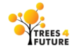
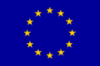

 
*This workshop is organised with funds from the European Union’s Seventh Framework Programme for research, technological development and demonstration under grant agreement n° 284181 (“Trees4Future”)*

December 10–11 2015

[IBL](http://www.ibles.pl/) Forest Research Institute.

Warsaw, Poland 2015

#### Workshop materials

- Download all [materials compressed](breedR_IBL.zip)
- **Session 1**: breedR Overview. (We used the most current vignette in the package and the Wiki, so I simply link there.) [html](https://github.com/famuvie/breedR/wiki/Overview) [pdf](https://github.com/famuvie/breedR/wiki/Overview.pdf) [code](https://github.com/famuvie/breedR/blob/master/inst/doc/Overview.R) 
- **Session 2**: Douglas case study. [slides (html)](Douglas_case_study.html) [code](Douglas_case_study.R)
- **Session 3**: Introduction to Genotype–Environment interaction. [slides](gbye_concepts_LSanchez.pdf) [Ecovalence generator (script R)](ecovalence_generator.R) 
- **Session 4**: GxE with breedR. [slides](GEI.html) [code](GEI.R)
- **Session 5**: Genomic Selection. [slides](Brief_intro_GS_LSanchez.pdf) [example data](dat_gs.zip) [code](metagene_gs.R)

Note: some of the slides are in html format and require an internet connection to display correctly.
If you want a standalone copy for local off-line visualization, you can find one in the compressed materials.
